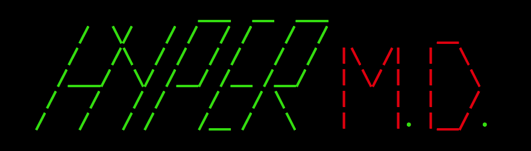

# HyperMD

HyperMD is a markdown variant with special heatures for the web, as well as compiling to html. Check out the [HyperMD Guide](https://github.com/Riib11/HyperMD/wiki/HyperMD---Guide) for syntax specifics.

## Prerequisites

- pip3
- git

## Installation

    # downloads this repository
    git clone https://github.com/Riib11/HyperMD.git ~/git/HyperMD
    # installs bash commands, installs python3 module
    sh ~/git/HyperMD/install.sh

## Updating

    sh ~/git/HyperMD/update.sh

## Compiling to HTML

    hypermd <input>.hmd